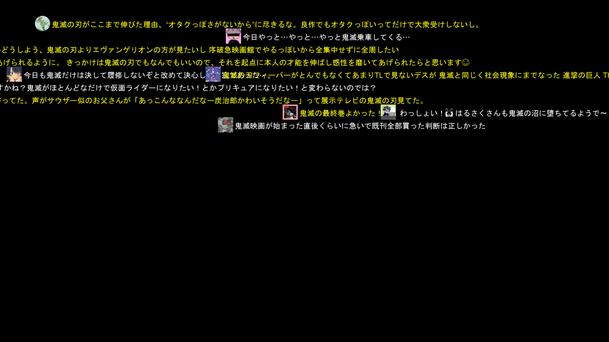

# NicoNicoTwitter

Twitter の検索機能の結果をニコニコ動画のコメント風に流します。

- クロマキー合成で使うことを前提としているので透過背景ではありません。
- マルチプラットフォーム対応です。
    - Windows
      
    - Mac
      
    - Linux ... Not Tested
- 強調表示やアイコン表示があるのでより盛り上がることができます。
  
- 安定したFPSでコメントを表示することができます。 表示に関する設定もあるので、実行環境に合わせた設定にしてください。

## 依存関係

| 名前                                                       | バージョン |
|-----------------------------------------------------------|----------|
| [Kotlin JVM](https://github.com/jetbrains/kotlin)         | 1.4.20   |
| [Penicillin](https://github.com/StarryBlueSky/Penicillin) | 5.0.0    |
| [Ktor Client CIO](https://github.com/ktorio/ktor)         | 1.4.1    |
| [klock](https://github.com/korlibs/klock)                 | 2.0.1    |